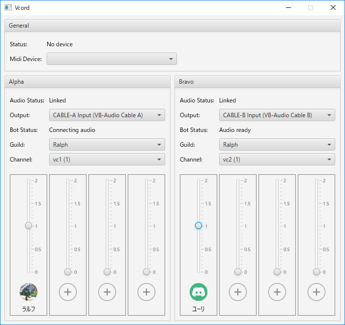

# Vcord

An utility software to live stream the voice of the 4 vs 4 battle on Discord.

## Screenshot



## Features

- Outputs audio from up to two voice channels to different audio interfaces.
- Adjusts the volume for each player.
- Controls volume via MIDI controller.

## Getting started

### Config

All settings are written in `config.yml`

```yaml
default_midi_device_id: "{midi device id}"

alpha:
  discord_bot_api_key: "{discord bot api key}"
  default_audio_device_id: "{audio interface id}"

bravo:
  discord_bot_api_key: "{discord bot api key}"
  default_audio_device_id: "{audio interface id}"
```

`midi device id` and `discord bot api key` can be found in application log.
